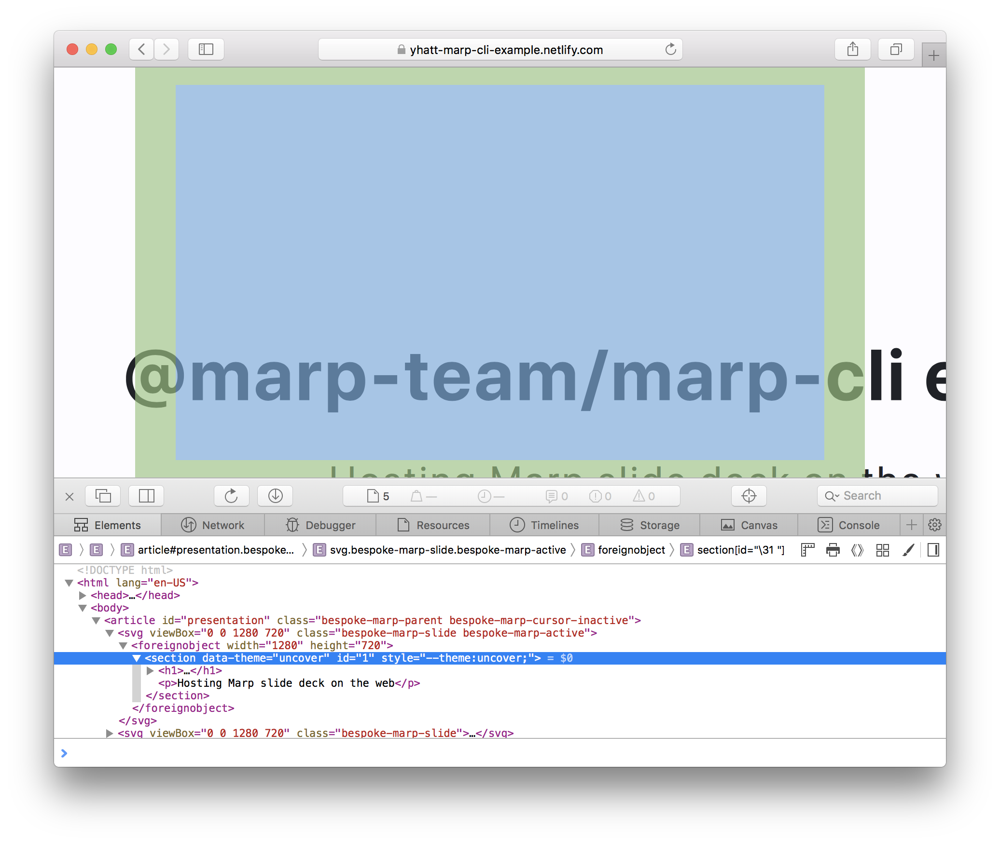

# @marp-team/marpit-svg-webkit-polyfill

[](https://circleci.com/gh/marp-team/marpit-svg-webkit-polyfill/)
[](https://codecov.io/gh/marp-team/marpit-svg-webkit-polyfill)
[](https://www.npmjs.com/package/@marp-team/marpit-svg-webkit-polyfill)
[](./LICENSE)

WebKit polyfill for [the inline SVG slide][inline-svg] rendered by [Marpit].

[marpit]: https://github.com/marp-team/marpit
[inline-svg]: https://marpit.marp.app/inline-svg

## Usage

Under construction.

## Why need?

[Marpit]'s [inline SVG slide][inline-svg] has a lot of advantages: No requires JavaScript, gives better performance for scaling, and has predicatable DOM structure.

But unfortunately, WebKit browser has not scaled the wrapped HTML correctly. It is caused from a long standing [bug 23113](https://bugs.webkit.org/show_bug.cgi?id=23113), and it does not resolved in the last 10 years.



Through inspector, we have not confirmed that there is a wrong layout in SVG itself and around. Thus, the problem has in a rendering of the parent SVG.

Actually, the nested SVG seems to be scaled correctly (e.g. `<!--fit-->` keyword in [Marp Core](https://github.com/marp-team/marp-core)).

## Solutions

Normally these will apply only in WebKit based browser, includes Safari and iOS browsers.

### Scaling

We try to simulate scaling and centering by applying `transform` / `transform-origin` style to Marpit `<section>` elements.

```html
<svg viewBox="0 0 1280 960">
  <foreignObject width="1280" height="960">
    <section
      style="transform-origin:0 0;transform:translate(123px,456px) scale(0.36666);"
    >
      ...
    </section>
  </foreignObject>
</svg>
```

We have to get the computed size of SVG element, so the polyfill would make a sacrifice of zero-JS feature.

### Repainting

WebKit browser would not trigger repainting even if modified the contents of slide. It becomes a problem when supporting the live preview feature in [Marp Web](https://web.marp.app/).

Fortunately, [a genius is already resolved this problem only in CSS!](https://stackoverflow.com/a/21947628) `transform:translateZ(0)` would trigger re-painting immidiately when modified contents.

### Apply polyfill manually (for Blink browsers)

We have confirmed a similar rendering bug in a few Blink based browsers. (e.g. Chrome 66, Electron 3.x. refs: [marp-team/marpit#35](https://github.com/marp-team/marpit/pull/35), [marp-team/marp-cli#15](https://github.com/marp-team/marp-cli/pull/15))

We are not applied polyfill for Blink browsers because [they are working toward to resolve this.](https://bugs.chromium.org/p/chromium/issues/detail?id=467484) But you can apply polyfill manually if you required.

```javascript
// TODO: Add example code
```

## Contributing

We are following [the contributing guideline of marp-team projects](https://github.com/marp-team/marp/blob/master/.github/CONTRIBUTING.md). Please read these guidelines this before starting work in this repository.

## Author

Managed by [@marp-team](https://github.com/marp-team).

-  Yuki Hattori ([@yhatt](https://github.com/yhatt))

## License

This module releases under the [MIT License](LICENSE).
